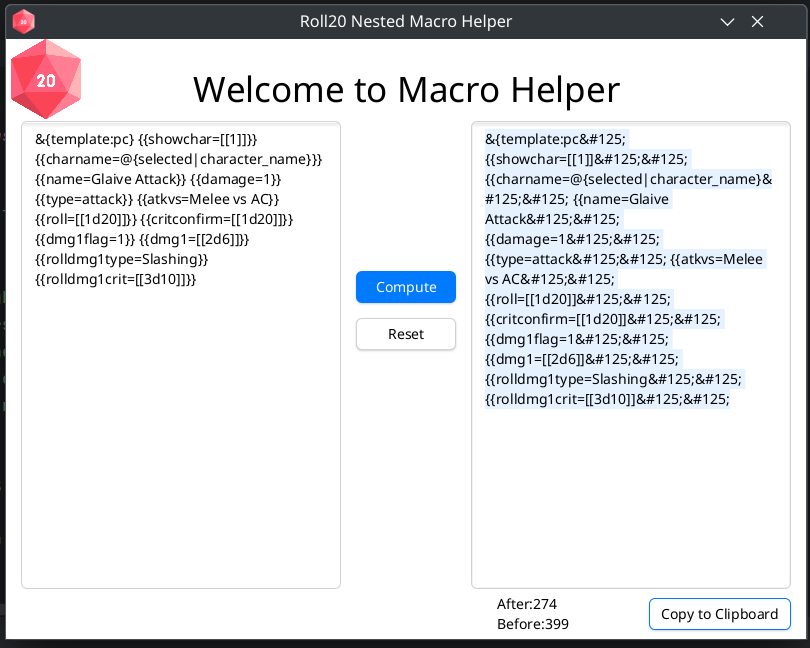

### Overview
Welcome this repository contains a little utility tool to help modifying [nested](https://wiki.roll20.net/Macros/Nested_Macros) macros for the roll20VTT system, removing `}` `,` and `|` with their correct HTML entities.


### Key Features
- Insert your full macro inside the textfield and pressing compute, does remove all the troubling character needed without ruining your macro.
- Copy the modified macro with the Button copy to clipboard, and you are good to go. Happy Nested macroing!


### System Requirements
- A functioning computer with a functioning operating system. 
- JDK23+ to run the program. 

## Example
Transform this:

`&{template:pc} {{showchar=[[1]]}} {{charname=@{selected|character_name}}} {{name=Glaive Attack}} {{damage=1}} {{type=attack}} {{atkvs=Melee vs AC}} {{roll=[[1d20]]}} {{critconfirm=[[1d20]]}} {{dmg1flag=1}} {{dmg1=[[2d6]]}} {{rolldmg1type=Slashing}} {{rolldmg1crit=[[3d10]]}}
`

in this:

`&{template:pc&#125; {{showchar=[[1]]&#125;&#125; {{charname=@{selected|character_name}&#125;&#125; {{name=Glaive Attack&#125;&#125; {{damage=1&#125;&#125; {{type=attack&#125;&#125; {{atkvs=Melee vs AC&#125;&#125; {{roll=[[1d20]]&#125;&#125; {{critconfirm=[[1d20]]&#125;&#125; {{dmg1flag=1&#125;&#125; {{dmg1=[[2d6]]&#125;&#125; {{rolldmg1type=Slashing&#125;&#125; {{rolldmg1crit=[[3d10]]&#125;&#125;`


It should work with any template roll for any system used on Roll20. But i tested it only with [Pathfinder by Roll20 Roll Templates](https://wiki.roll20.net/Pathfinder_by_Roll20/Roll_Templates)  
## Screenshot




## License

```
DO WHAT THE FUCK YOU WANT TO PUBLIC LICENSE
                    Version 2, December 2004

 Copyright (C) 2024 DOSTI
  University of Rome Tor Vergata
 Everyone is permitted to copy and distribute verbatim or modified
 copies of this license document, and changing it is allowed as long
 as the name is changed.

            DO WHAT THE FUCK YOU WANT TO PUBLIC LICENSE
   TERMS AND CONDITIONS FOR COPYING, DISTRIBUTION AND MODIFICATION

  0. You just DO WHAT THE FUCK YOU WANT TO.
```
